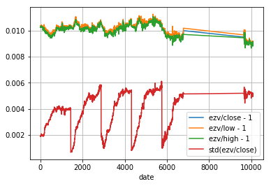

# Swiss currency exchange rates from EZV

This repo contains a scrape of the official currency exchange rates relevant
for swiss tax purposes as provided by:
  * http://www.pwebapps.ezv.admin.ch/apps/rates/
  * https://www.ictax.admin.ch/

Data is broken up by symbol into `<symbol>.csv` files with schema:
  * date: YYYY-MM-DD
  * symbol: currency code, three letters
  * price: price of a single unit of this currency in swiss franks (decimal)
  * currency: price unit, always CHF

Note: the rate for a particular date is effective for tax purposes for transactions on
the *next* day, i.e. make sure to shift the dates after reading.

## Joined data

For convenience, joined data is also provided, both in long (ezv.long.csv) and
wide format (ezv.wide.csv). Wide format also contains some additional derived
columns: GBX=GBP/100, CHF=1.

Sample code to read the data:

```
import pandas as pd
import decimal

# Read wide format as floats:
df = pd.read_csv('ezv.wide.csv', parse_dates=['date'], index_col=['date'])

# Read long format as decimals:
df = pd.read_csv('ezv.long.csv', converters={'price': decimal.Decimal},  parse_dates=['date'])

# Pivot to wide:
df = df.pivot('date', 'symbol', 'price')
```

## Downloader

Use `./fetch.py` to download latest updates, merge them into .csv's and
regenerate joined files.

Edit currencies.csv to specify which currencies should get fetched or
pass `--all` flag to download all available currencies.


## Bias

Comparison with fine-grained price data from third party sources
reveals that EZV appears to collect its data around 3am UTC and
**there's a systematic 1% bias**. For example deviation for USD/CHF
averaged over minute-of-the-week:

```
import pandas as pd
df = pd.read_csv(
  'FX-1-Minute-Data/full-data-2000-2017/usdchf/DAT_ASCII_USDCHF_M1_2016.csv',
  parse_dates=[0], index_col=0, delimiter=';',
  names=['date', 'open', 'high', 'low', 'close', 'vol'])
df['ezv'] = pd.read_csv('ezv/USD.csv', parse_dates=[0], index_col=[0]).price
df = df.ffill().dropna(how='any')

def agg_fn(df):
  return pd.DataFrame({
    'ezv/close - 1': df.ezv/df.close-1,
    'ezv/low - 1': df.ezv/df.low-1,
    'ezv/high - 1': df.ezv/df.high-1,
    'std(ezv/close)': (df.ezv/df.close).std()
  }).mean()

df.groupby(df.index.dayofweek * 24 * 60 + df.index.hour * 60 + df.index.minute).apply(agg_fn).plot(grid=True)
```


